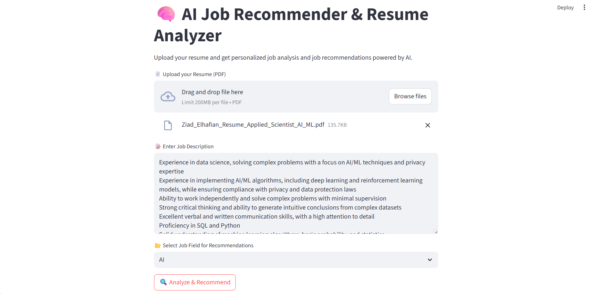
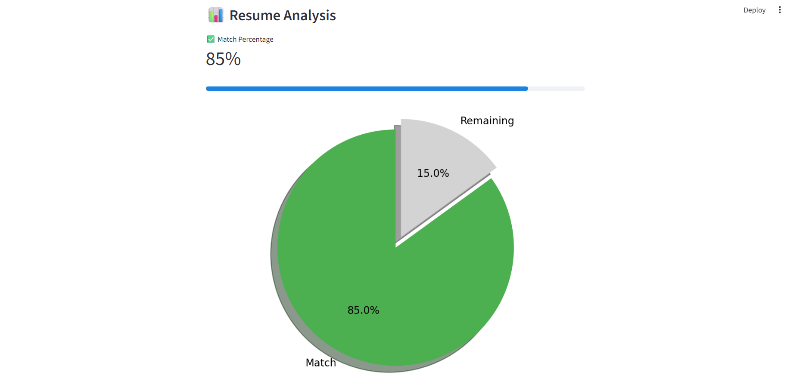

<h1 align="center">⚡ AI Job Recommender (Powered by Groq LLMs)</h1>

<p align="center">
  Fast & intelligent resume-to-job matching using <strong>Groq</strong> for lightning-speed LLM inference.<br>
  Upload your CV → Get personalized job recommendations instantly.
</p>

<p align="center">
  <a href="https://github.com/Ziad-el3shry/ai-job-recommender">
    
  </a>
  <a href="https://github.com/Ziad-el3shry/ai-job-recommender">
    
  </a>
  <a href="https://groq.com/">
    
  </a>
</p>

---

## ⚡ Built with Groq

This app uses **GroqCloud LPU inference** to deliver ultra-fast LLM responses for:

- Resume parsing
- Skill extraction
- Job matching
- Natural language ranking

Groq provides inference speeds measured in **tokens per millisecond**, making the experience real-time and smooth.

---

## 🧠 What It Does

- 📝 Upload a resume in PDF format
- 🤖 Groq LLM analyzes skills, experience, and strengths
- 📂 Compares user profile to job descriptions in a dataset
- 🎯 Shows top matching jobs and scores
- 📥 Allows PDF download of the analysis report

---

## 🖼 UI Preview

<p align="center">
  
  
</p>

---

## 🗂️ Folder Structure

```
ai-job-recommender/
│
├── app.py                # Streamlit frontend
├── groq_helper.py        # Groq LLM call logic
├── job_dataset.csv       # Job descriptions
├── requirements.txt
├── .gitignore
├── .env (contains GROQ_API_KEY)
├── README.md
│
├── assets/               # UI images
│   ├── ui_1.png
│   └── ui_2.png
│
└── sample_data/          # Sample resume & job files
    ├── sample_cv.pdf
    ├── sample_job.txt
    └── resume_analysis.pdf
```

---

## 🚀 Getting Started

```bash
# 1. Clone the repository
git clone https://github.com/Ziad-el3shry/ai-job-recommender
cd ai-job-recommender

# 2. Install dependencies
pip install -r requirements.txt

# 3. Add your Groq API key to .env
echo "GROQ_API_KEY=your_key_here" > .env

# 4. Run the app
streamlit run app.py
```

---

## 🧪 Sample Data

- `sample_cv.pdf`: A sample CV for testing
- `sample_job.txt`: A sample job description
- `resume_analysis.pdf`: Example of a generated analysis report

---

## 💼 Tech Stack

| Component     | Description                     |
|---------------|---------------------------------|
| **Python**    | Main language                   |
| **Streamlit** | UI for web app                  |
| **Groq API**  | Ultra-fast LLM inference        |
| **FPDF**      | PDF report generation           |
| **dotenv**    | Secure key handling             |

---

## 📌 Features

- 🔍 Resume parsing via Groq LLM
- 📊 Skill matching to job dataset
- 📈 Match score calculation
- 📄 Exportable report
- 💡 Clean Streamlit UI

---

## 🧩 Future Enhancements

- [ ] Real-time web scraping from job boards
- [ ] Multiple resume uploads
- [ ] Embedding-based vector search
- [ ] Hugging Face Spaces deployment

---

## 🙋 Author

**Ziad Elhafian** — AI Developer  
💼 [LinkedIn](https://www.linkedin.com/in/ziad-attia-4b1843241/)  
📫 Feel free to connect!

---

> ⚡ Powered by [Groq](https://groq.com) for real-time large language model inference.
